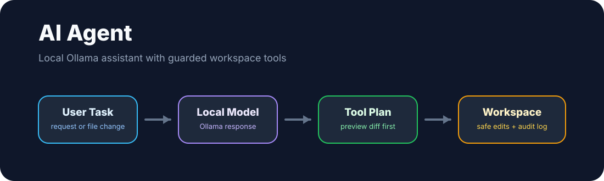

# AI Agent

AI Agent is the agent version of my existing AI Chatbot project.

AI Chatbot focuses on conversation. AI Agent keeps the same local Ollama idea, but gives the assistant a guarded workspace so it can inspect tasks, preview file changes, apply edits, run safe local checks, and save an audit trail without hosted API calls or paid tokens.



## Features

- Runs locally with Ollama
- Provides a Streamlit chat interface
- Restricts file actions to one selected workspace
- Previews unified diffs before changes are applied
- Applies create, append, replace, and delete operations
- Runs local checks through a command allowlist
- Stores an audit log for every agent task
- Works without OpenAI, Gemini, Anthropic, or hosted model APIs

## How it is different

AI Chatbot is mainly for conversation. AI Agent is for action.

```text
AI Chatbot
└── talk with a local model

AI Agent
├── talk with a local model
├── choose a workspace
├── preview file changes
├── apply safe edits
├── run local checks
└── save an audit log
```

## Setup

Install Ollama and pull a local model:

```bash
ollama serve
ollama pull qwen2.5-coder:7b
```

Create a virtual environment:

```bash
python3 -m venv .venv
.venv/bin/python -m pip install -r requirements.txt
.venv/bin/python -m pip install -e .
```

## Run

Start the Streamlit app:

```bash
streamlit run main.py
```

Run a command-line task:

```bash
ai-agent --workspace demo_workspace --task "create notes.txt with a short project summary" --apply
```

Run tests:

```bash
.venv/bin/python -m pytest
```

## Structure

```text
main.py                 Streamlit app
src/ai_agent/agent.py   Agent task coordination
src/ai_agent/filesystem.py
                        Guarded file tools and diff previews
src/ai_agent/commands.py
                        Safe command runner
src/ai_agent/ollama.py  Local Ollama client
tests/                  Unit tests
```

## Project status

This is a focused portfolio prototype. It is intentionally small, readable, and beginner-friendly, while still showing the main pieces behind a local agent: model connection, workspace boundaries, file tools, command safety, diff previews, and auditability.
